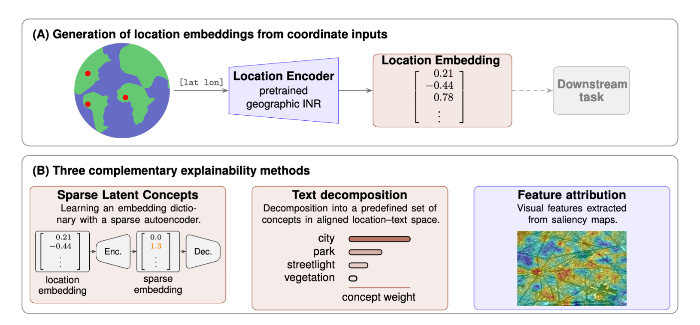

# Explainable Earth Embeddings

In this work, we analyze the information content of geographic INRs through their location embeddings. We decompose these embeddings into human-interpretable features---namely, (i) sparse latent concepts, (ii) natural language concepts, and (iii) visual features.

[TO DO: maybe rephrase. Currently taken from abstract]

[TO DO: Link arXiv]

[TO DO: Add license (@Sebastian I think you have to do this since you own the repo)]



---

## Overview

The latent concept embeddings are learned using sparse autoencoders (cite repo?). To recover natural language concepts, we apply Sparse Linear Concept Embeddings (SpLiCE) using the official implementation from the [SpLiCE repository](https://github.com/AI4LIFE-GROUP/SpLiCE). Finally, visual features are extracted using saliency maps derived from CLIP Surgery (cite repo?).

---

## Repository Structure

```
src/
├── location_encoders/      # Pretrained location encoders that need source code (SatCLIP, SINR, CSP)
└── explainability/
    ├── splice/             # SPLICE decomposition + location-text alignment training
    │   └── location_text_alignment/
    ├── sae/                # Sparse autoencoder
    └── clip_surgery/       # CLIP Surgery
notebooks/
├── splice_demo.ipynb
├── sae_demo.ipynb
└── clip_surgery_demo.ipynb
configs/
└── location_text_alignment.yaml
```

---

## Methods

| Method | Description |
|---|---|
| **SAE** | DESCRIPTION |
| **SPLICE** | Decomposes location embeddings into sparse combinations of natural language concepts |
| **CLIP Surgery** | DESCRIPTION |

---

## Setup

```bash
pip install -r requirements.txt
```

See other setup details in specific explainability methods.

---

## SAE

> Full details: [`src/explainability/sae/README.md`](src/explainability/sae/README.md)

DESCRIPTION OF SAE APPROACH.

Demo: [`notebooks/sae_demo.ipynb`](notebooks/sae_demo.ipynb)

---

## SPLICE

> Full details: [`src/explainability/splice/README.md`](src/explainability/splice/README.md)

Adapts [SPLICE (ai4life-group)](https://github.com/ai4life-group/splice) to geospatial location encoders via a trained location-text alignment model.

**Steps:**
1. Train location-text alignment: [`src/explainability/splice/location_text_alignment/README.md`](src/explainability/splice/location_text_alignment/README.md)
2. Create a grid of latitude-longitude coordinates over the landmasses.
3. Run SPLICE decomposition (also generates figures): [`notebooks/splice_demo.ipynb`](notebooks/splice_demo.ipynb)

---

## CLIP Surgery

> Full details: [`src/explainability/clip_surgery/README.md`](src/explainability/clip_surgery/README.md)

DESCRIPTION OF CLIP SURGERY APPROACH.

Demo: [`notebooks/clip_surgery_demo.ipynb`](notebooks/clip_surgery_demo.ipynb)

---

## Location Encoders

The following pretrained location encoders are supported:

| Encoder | Source |
|---|---|
| GeoClip | [VicenteVivan/geo-clip](https://github.com/VicenteVivan/geo-clip) |
| SatCLIP | [microsoft/satclip](https://github.com/microsoft/satclip) |
| Climplicit | [ecovision-uzh/Climplicit](https://github.com/ecovision-uzh/climplicit) |
| CSP (FMoW) | [gengchenmai/csp](https://github.com/gengchenmai/csp) |
| SINR | [elijahcole/sinr](https://github.com/elijahcole/sinr) |

---

## Citation

```bibtex
Add citation if and when we have one!
```
